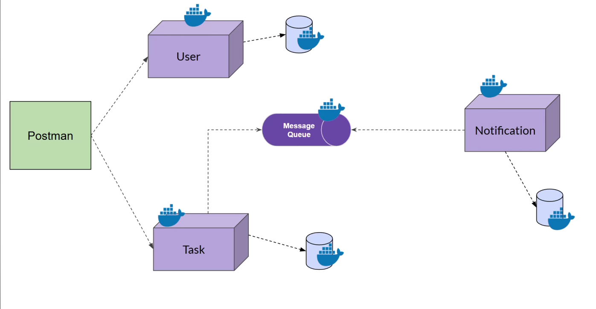

# 🧩 ToDo Microservices Application

This project demonstrates a **microservices-based ToDo backend system** using **Dockerized services** and **RabbitMQ** for **event-driven communication**.  
Each service — **User**, **Task**, and **Notification** — operates independently and communicates asynchronously through RabbitMQ, ensuring scalability, modularity, and fault tolerance.

---

## 🚀 Architecture Overview



**Components:**
- **User Service:** Handles user creation and retrieval.
- **Task Service:** Manages task creation and retrieval; publishes task creation events to RabbitMQ.
- **Notification Service:** Subscribes to RabbitMQ events and processes notifications.
- **RabbitMQ:** Enables asynchronous communication between services.
- **MongoDB:** Each service uses its own MongoDB instance for data persistence.
- **Postman:** Used for testing and API interaction.

---

## 🧱 Tech Stack

| Component | Technology |
|-----------|------------|
| Backend Framework | Node.js + Express |
| Messaging Queue | RabbitMQ |
| Database | MongoDB |
| Containerization | Docker & Docker Compose |
| Testing | Postman |
| Architecture | Event-driven Microservices |

---

## ⚙️ Services Overview

### 🧍 User Service

#### **POST** `/users` - Create a new user

**Request Body:**
```json
{
  "name":"Alice" , 
  "email":"alice@gmail.com"
}
```

**Response:**
```json
{
  "name": "Alice",
  "email": "alice@gmail.com",
  "_id": "68e417de8b84abd87788673c",
  "__v": 0
}
```

#### **GET** `/users` - Retrieve all users

**Response:**
```json
[
  {
    "_id": "68e35fb27ef2f5e1c582e058",
    "name": "Alice",
    "email": "alice@gmail.com",
    "__v": 0
  }
]
```

---

### ✅ Task Service

#### **POST** `/tasks` - Create a new task

Publishes a **task_created** event to RabbitMQ.

**Request Body:**
```json
{
  "title" : "Meeting With Manager",
  "description" : "Discuss the Archtecture for New Project",
  "userId" : "228997"
}
```

**Response:**
```json
{
  "title": "Meeting With Manager",
  "description": "Discuss the Archtecture for New Project",
  "userId": "228997",
  "_id": "68e41bf199c281514460a3b6",
  "createdAt": "2025-10-06T19:43:45.712Z",
  "__v": 0
}
```

#### **GET** `/tasks` - Retrieve all tasks

**Response:**
```json
[
  {
    "_id": "68e41bf199c281514460a3b6",
    "title": "Meeting With Manager",
    "description": "Discuss the Archtecture for New Project",
    "userId": "228997",
    "createdAt": "2025-10-06T19:43:45.712Z",
    "__v": 0
  }
]
```

---

### 🔔 Notification Service

- Subscribes to RabbitMQ and listens for **task_created** events.
- Processes events to trigger notifications.
- Stores notification logs in its MongoDB instance.

**Response:**
```json
{
  "taskId": "68e41bf199c281514460a3b6",
  "userId": "228997",
  "title": "Meeting With Manager"
}
```

**Event Processing:**
```json
{
  "event": "task_created",
  "taskId": "64f3b5c2d8e99e002a7f3d4e",
  "userId": "64f3b2a1c9e77d001f8e4c2b",
  "title": "Complete project documentation",
  "timestamp": "2024-09-03T10:30:00Z"
}
```

---

## 🐳 Dockerized Setup

All components are containerized using **Docker** for consistent deployment and easy orchestration.

### 🧩 Dockerized Components

- `user-service`
- `task-service`
- `notification-service`
- `rabbitmq`
- `mongodb` (individual instances per service)

---

## ▶️ How to Run

1. **Clone the Repository**

   ```bash
   git clone https://github.com/<your-username>/<repo-name>.git
   cd <repo-name>
   ```

2. **Start All Services**

   ```bash
   docker-compose up --build
   ```

3. **Access Services**

   | Service | Port |
   |---------|------|
   | User Service | `http://localhost:8000` |
   | Task Service | `http://localhost:8001` |
   | Notification Service | `http://localhost:8002` |
   | RabbitMQ Dashboard | `http://localhost:15672` (guest/guest) |

4. **Test with Postman**  
   Use Postman to send requests to User and Task services and observe Notification events.

---

## 📬 Event Flow Summary

1. User creates a task via **Task Service**.
2. Task Service publishes a `task_created` event to **RabbitMQ**.
3. **Notification Service** listens to RabbitMQ and processes the event.
4. Notification is logged/stored in the Notification database.

---

## 🧠 Key Highlights

- ✅ Event-driven asynchronous communication using RabbitMQ.
- ✅ Independent MongoDB instances for each service.
- ✅ Dockerized microservice architecture for scalability.
- ✅ Clear service separation and clean API design.

---

## 📄 License

This project is licensed under the **MIT License** — feel free to use and modify it.

---

## 👨‍💻 Author

**Shantanu Rai**  
💼 Microservices | Node.js | Docker | RabbitMQ | MongoDB

---

## 📂 Project Structure

```
todo-microservices/
├── user-service/
├── task-service/
├── notification-service/
├── images/
├── docker-compose.yml
└── README.md
```
---

## ⭐ Show Your Support

Give a ⭐️ if this project helped you!